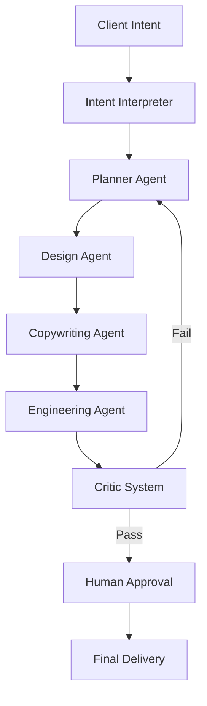
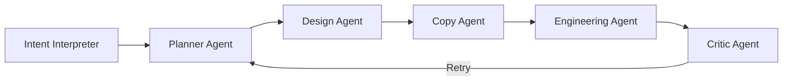
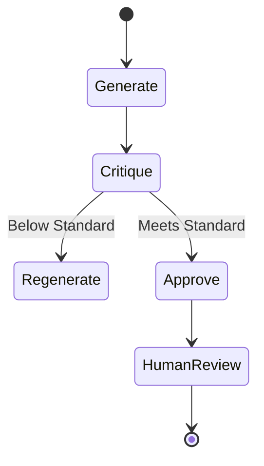
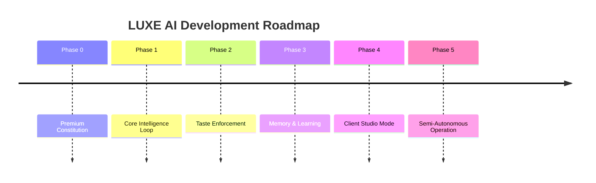

# ✨ LUXE AI

### *Taste-Driven Autonomous Creative Studio*

  An autonomous AI system that plans, designs, builds, critiques, and refines premium digital work- requiring only final human approval.

---

## 🧠 What is LUXE AI?

**LUXE AI** is a **private, taste-driven autonomous creative system**.

Clients describe *what they want*.
The system does **everything else**:

* Interprets intent
* Plans the work
* Designs the experience
* Writes copy
* Generates production-ready code
* Critiques itself
* Iterates until standards are met

👉 **Nothing ships unless it is premium.**

The human role is **approval, not execution**.

---

## 🎯 Core Philosophy

> **Quality is enforced, not requested.**
> **Taste is a system, not a preference.**
> **Autonomy without standards is useless.**

LUXE AI exists to answer one question only:

> *“Is this good enough to represent my name?”*

If not — it retries.

---

## 🧩 High-Level Architecture

---

## 🧠 Agent System

LUXE AI is not a single model — it is a **studio of specialists**.

Each agent has:

* One responsibility
* Structured outputs
* No creative overlap

This mirrors how elite studios actually work.

---

## 🧪 Quality Enforcement (Non-Negotiable)

Before any human sees the output, LUXE AI evaluates:

* Visual hierarchy
* Spacing discipline
* Copy originality
* Brand confidence
* Responsiveness
* Emotional restraint

If standards fail → **automatic regeneration**.

---

## 🧬 Taste Memory (Future Phase)

LUXE AI learns from decisions:

* Approved work → reinforced
* Rejected work → avoided
* “Feels cheap” → never repeated

Over time, the system converges toward a **signature style**.

---

## 🏗️ Phased Development Plan

---

## 🚀 Current Phase

### **Phase 0 — Foundation**

* Defining premium standards
* Codifying taste rules
* Designing critic logic
* No UI, no clients, no shortcuts

> *We build the brain before the body.*

---

## 🔒 Project Status

* **Private system**
* **Not a SaaS (yet)**
* **Built for long-term leverage**
* **Zero compromise on quality**

---

## 🧭 Why LUXE AI Exists

Most tools optimize for:

* Speed
* Cost
* Output volume

LUXE AI optimizes for:

* **Taste**
* **Restraint**
* **Confidence**
* **Premium feel**

This is not about doing more.
This is about doing **better — always**.

---

## 👤 Role of the Human

The human does **one thing only**:

> **Approve or reject.**

No micromanagement.
No fixing CSS.
No rewriting copy.

Taste becomes infrastructure.

---

## 📌 License

**Private / Internal Use Only**
Not open for redistribution.

---

### ✨ LUXE AI

**I Raise Standards.**

